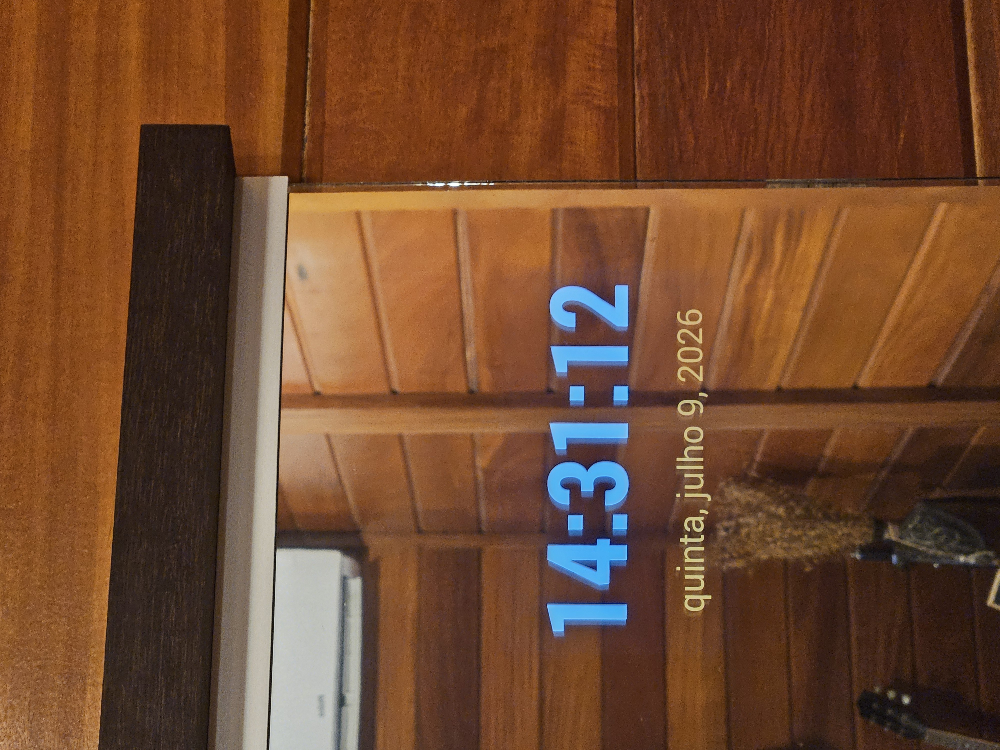

# MirrorClock

A high-contrast, immersive digital clock app for Android tablets, specifically optimized for legacy devices (Android 4.4.4+) and designed to be used behind a one-way mirror.

## The "Mirror" Concept
MirrorClock is designed to be the "brain" of a simple smart mirror. By placing a tablet running this app behind a one-way (two-way) mirror, the deep black background disappears, leaving only the vibrant white and colored text visible through the glass. This creates a sleek, futuristic digital clock effect directly on your mirror's surface.

## Features
- **Massive Legibility**: High-contrast white text for time (HH:mm:ss) and vibrant accents for the date.
- **Adaptive Scaling**: Custom layouts for phones and tablets to maximize screen usage.
- **Legacy Optimized**: Full support for Android 4.4.4 (KitKat) and above, making it perfect for repurposing old hardware.
- **True Full-Screen**: Immersive mode hides all system bars (status and navigation) for a seamless look.
- **Always-On**: The app prevents the screen from dimming or sleeping while active.
- **Locked Landscape**: Fixed orientation for stable mounting behind glass.

## Hardware Setup
To build your own MirrorClock, you'll need:
1. An Android tablet (Old KitKat tablets are perfect!).
2. A one-way mirror (or a glass pane with one-way mirror film applied).
3. A frame to hold the glass and tablet together.

### Process:
- **Mounting**: Secure the tablet against the back of the one-way mirror. Ensure the screen is flush against the glass to prevent light bleed.
- **Masking**: Use black electrical tape or cardstock around the edges of the tablet to ensure no light from the frame or cables shows through.
- **Power**: Route a thin USB cable to a power source to keep the clock running 24/7.

  
  
   
  <em>Hardware assembly: Positioning the tablet (left) and the final high-contrast mirror effect (right).</em>

## Tech Stack
- **Language**: Kotlin
- **UI Architecture**: MVVM with Kotlin Coroutines for real-time updates.
- **UI Framework**: Android XML View System (ensuring compatibility with API 19).
- **Design System**: Material 3 (Expressive High-Contrast).

---
*Created for minimalist smart home enthusiasts.*
